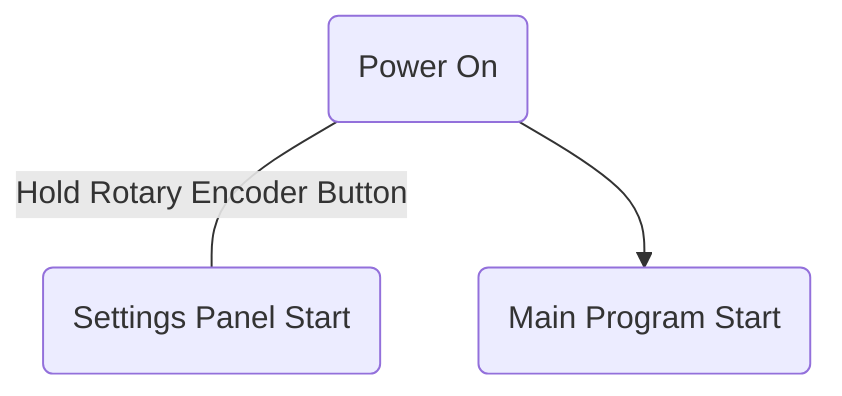
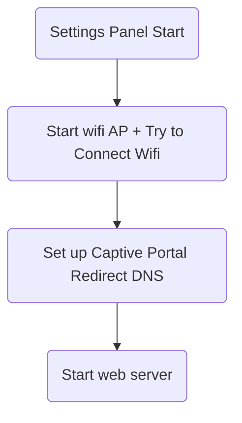

# Firmware for 16x16 LED array + rotary encoder as a Go Board connected to online-go.com

how should work 

```mermaid
flowchart TD;
    A(Power On)
    B(Settings Panel Start)
    C("Main Program Start")
    A---|Hold Rotary Encoder Button |B;
    A-->C

```

```mermaid
flowchart TD;
    A(Settings Panel Start)
    B(Start wifi AP + Try to Connect Wifi)
    C(Set up Captive Portal Redirect DNS)
    D(Start web server)
    A--> B --> C --> D
```

